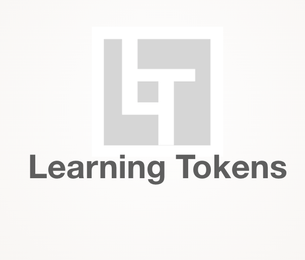

<a name="readme-top"></a>

[![MIT License][license-shield]][license-url]
[![LinkedIn][linkedin-shield]][linkedin-url]

<br />
<div align="center">
  <a href="https://github.com/TanjinAlam/Learning-Token-SDK">
    
  </a>

  <h1 align="center">Learning Tokens SDK</h1>

  <p align="center">
     Tokenizing Formal and Informal Learning
    <br />
    <a href="#"><strong>Explore the docs »</strong></a>
    <br />
    <br />
    <a href="#">View Demo</a>
    ·
    <a href="https://github.com/TanjinAlam/Learning-Token-SDK/issues">Report Bug</a>
    ·
    <a href="https://github.com/TanjinAlam/Learning-Token-SDK/issues">Request Feature</a>
  </p>
</div>

<details>
  <summary>Table of Contents</summary>
  <ol>
    <li>
      <a href="#about-the-project">About Learning Tokens</a>
      <ul>
        <li><a href="#built-with">Built With</a></li>
      </ul>
    </li>
    <li>
      <a href="#getting-started">Getting Started</a>
      <ul>
        <li><a href="#prerequisites">Prerequisites</a></li>
        <li><a href="#installation">Installation</a></li>
      </ul>
    </li>
    <li><a href="#usage">Usage</a></li>
    <li><a href="#roadmap">Roadmap</a></li>
    <li><a href="#contracts">Contracts</a></li>
    <li><a href="#license">License</a></li>
    <li><a href="#contact">Contact</a></li>
    <li><a href="#acknowledgments">Acknowledgments</a></li>
  </ol>
</details>

## About Learning Tokens

Learning Tokens is an open-source mechanism that uses the composable Interwork Alliance Token Taxonomy Framework (IWA TTF) to produce a Learning Token as a positive reinforcer that recognizes, registers, and certifies skills acquisition and competencies while rewarding community engagement in collective learning.

### Built With

- [![TypeScript][typescript]][typescript-url]
- [![Axios][axios]][axios-url]

<p align="right">(<a href="#readme-top">back to top</a>)</p>

<!-- GETTING STARTED -->

## Getting Started

Proceed with the following steps to get Learning Token SDK up and running on any device

### Prerequisites

- npm
  ```sh
  npm install npm@latest -g
  ```
- yarn
  ```sh
  npm install yarn -g
  ```

### Installation

1. Get a free API Key at
   - Yet to come🔜
2. Clone the repo
   ```sh
   git clone https://github.com/TanjinAlam/Learning-Token-SDK
   ```
3. Install packages

```sh
yarn install
```

Or

```sh
npm install
```

4. Create a `.env` file and enter fill up keys as per the `dev.env`

<p align="right">(<a href="#readme-top">back to top</a>)</p>

## Usage

## Build

```sh
npm run build
```

## Test

```sh
npm test
```

## Install in codebase

```sh
npm install learningTokenSDK
```

## Usage

```javascript
import { Client } from "learningTokenSDK";

const client = new Client("https://api.example.com");

async function getUser() {
  const response = await client.getUser(1);
  console.log(response.data);
}

getUser();
```

### USER DOCUMENTATION

- Yet to come🔜

### TECHNICAL DOCUMENTATION

- Yet to come🔜

## Roadmap

- [x] SDK Boilerplate
- [ ] SDK key creation
- [ ] Meet & Zoom configuration functions
- [ ] Pre-event data collection
- [ ] Post-event data collection
- [ ] Review Schema design

<p align="right">(<a href="#readme-top">back to top</a>)</p>

<!-- CONTRIBUTING -->

## Contributing

Follow the steps below to contribute to Learning Token SDK

1. Fork the Project
2. Create your Feature Branch (`git checkout -b feature/AmazingFeature`)
3. Commit your Changes (`js git commit -m 'Add some AmazingFeature`)
4. Push to the Branch (`git push origin feature/AmazingFeature`)
5. Open a Pull Request

<p align="right">(<a href="#readme-top">back to top</a>)</p>

<!-- LICENSE -->

## License

Distributed under the MIT License. See `LICENSE.txt` for more information.

<p align="right">(<a href="#readme-top">back to top</a>)</p>

<!-- CONTACT -->

## Contact

Learning Tokens - learningtokens@hyperledger.org

Project Link: [https://github.com/TanjinAlam/Learning-Token-SDK](https://github.com/TanjinAlam/Learning-Token-SDK)

<p align="right">(<a href="#readme-top">back to top</a>)</p>

<!-- ACKNOWLEDGMENTS -->

## Acknowledgments

- [Best-README-Template](https://github.com/othneildrew/Best-README-Template)

<p align="right">(<a href="#readme-top">back to top</a>)</p>

[license-shield]: https://img.shields.io/github/license/othneildrew/Best-README-Template.svg?style=for-the-badge
[license-url]: https://github.com/othneildrew/Best-README-Template/blob/master/LICENSE.txt
[linkedin-shield]: https://img.shields.io/badge/-LinkedIn-black.svg?style=for-the-badge&logo=linkedin&colorB=555
[linkedin-url]: https://www.linkedin.com/company/hyperledger-project/
[product-screenshot]: ./src/assets/landingPage.png
[typescript]: ./assets/ts.png
[typescript-url]: https://www.typescriptlang.org/
[axios]: ./assets/axios.png
[axios-url]: https://axios-http.com/docs/intro
